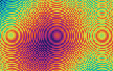
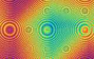

# sml-gif

[](https://github.com/sjqtentacles/sml-gif/actions/workflows/ci.yml)

Animated **GIF89a** encoder in pure Standard ML. Frames are
[`sml-image`](https://github.com/sjqtentacles/sml-image) RGBA images; the encoder
builds a global color table (exact when a sequence has &le; 256 distinct colors,
otherwise **median-cut quantization** to 256), **LZW**-compresses each frame, and
writes a looping GIF byte stream. No FFI, no external dependencies, and
**deterministic** — byte-identical output under both
[MLton](http://mlton.org/) and [Poly/ML](https://www.polyml.org/).



*Generated by [`examples/animate.sml`](examples/animate.sml) (`make example`): a
32-frame, seamlessly looping plasma built from integer triangle waves and an
integer colormap, posterized into contour bands and encoded straight to an
animated GIF. A single still frame:*



## Status

- 57 assertions, green on MLton and Poly/ML.
- Output is byte-identical across both compilers (the committed `.gif`/`.png` are
  reproduced bit-for-bit by either one).
- Spec-compliant: the demo decodes cleanly in third-party viewers (browsers,
  ImageMagick, Pillow), not just this library's own round-trip decoder.
- Vendors `sml-image` (and its `sml-inflate` + `sml-color`) under `lib/`
  (Layout B), so the repo builds standalone.

## Install

With [`smlpkg`](https://github.com/diku-dk/smlpkg):

```
smlpkg add github.com/sjqtentacles/sml-gif
smlpkg sync
```

Then reference the library's MLB (it pulls in the vendored `sml-image`):

```
local
  $(SML_LIB)/basis/basis.mlb
  lib/github.com/sjqtentacles/sml-gif/... (via smlpkg)
in
  ...
end
```

This brings `structure Gif` (and the vendored `Image`) into scope.

## Quick start

```sml
(* two solid frames, swapping colors, looping forever *)
fun solid (w, h) (r, g, b) : Image.image =
  { width = w, height = h
  , data = Word8Vector.tabulate (4 * w * h, fn i =>
      case i mod 4 of 0 => Word8.fromInt r | 1 => Word8.fromInt g
                    | 2 => Word8.fromInt b | _ => 0w255) }

val a = solid (64, 64) (220, 40, 40)
val b = solid (64, 64) (40, 80, 220)

val bytes : Word8Vector.vector =
  Gif.encode { width = 64, height = 64
             , frames = [ { image = a, delayCs = 50 }   (* 50 cs = 0.5 s *)
                        , { image = b, delayCs = 50 } ]
             , loop = 0 }                                (* 0 = loop forever *)

val os = BinIO.openOut "blink.gif"
val () = (BinIO.output (os, bytes); BinIO.closeOut os)
```

## API

```sml
exception Gif of string
type frame = { image : Image.image, delayCs : int }
val encode : { width  : int
             , height : int
             , frames : frame list
             , loop   : int } -> Word8Vector.vector
```

- `width`/`height` — logical screen size; every frame image must match exactly.
- `frames` — at least one frame, played in order; `delayCs` is the on-screen
  delay in **centiseconds** (1 cs = 1/100 s), as stored in the GIF Graphic
  Control Extension.
- `loop` — NETSCAPE2.0 loop count; `0` loops forever, `n > 0` plays `n` extra
  times.
- Alpha is ignored (GIF is opaque RGB). Bad input — no frames, non-positive or
  mismatched dimensions, out-of-range `delayCs`/`loop` — raises `Gif`.

## How it works

| Stage | What happens |
| --- | --- |
| Palette | scan every frame for distinct RGB; &le; 256 colors &rarr; exact (lossless) table, otherwise **median-cut** quantization to 256 |
| Indexing | map each pixel to its nearest palette entry (memoized) |
| LZW | GIF-variant Lempel-Ziv-Welch: variable-width codes (LSB-first), clear/EOI codes, dictionary reset at 4096, written as &le;255-byte sub-blocks |
| Container | header, logical screen descriptor, global color table, NETSCAPE2.0 loop extension, then per frame a Graphic Control Extension + Image Descriptor + LZW data, then the trailer |

The LZW code-width stepping follows the giflib/spec convention, so the bytes are
decodable by standard viewers; the test suite also re-decodes the output with an
independent decoder and checks pixels round-trip exactly on the lossless path.

### Determinism

Everything is integer arithmetic over the Basis library — no FFI, threads,
floating point, wall clock, or randomness — so a given animation encodes to the
exact same bytes on every run and on both compilers. The committed demo assets
are reproduced bit-for-bit by `make example` under MLton or Poly/ML.

## Build & test

```
make test        # MLton
make test-poly   # Poly/ML
make all-tests   # both
make example     # render assets/wave.gif + assets/wave_frame.png
make clean
```

## License

MIT — see [LICENSE](LICENSE).
